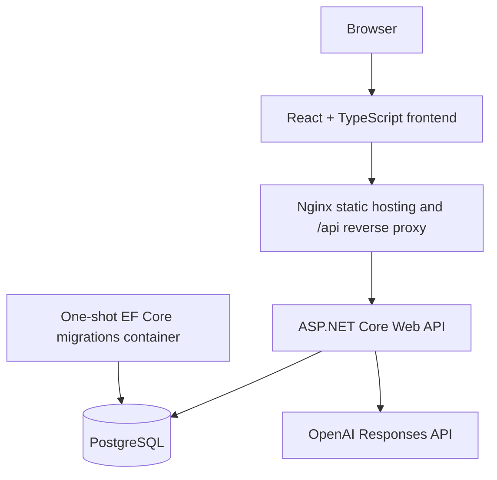

# CareerPilot AI

[](https://github.com/rabiaakdas/careerpilot-ai/actions/workflows/ci.yml)

CareerPilot AI is a full-stack, AI-powered job application and career management platform. It helps users manage job opportunities, track applications, upload resumes, and generate practical AI insights for career planning and interview preparation.

The project combines a React + TypeScript frontend with an ASP.NET Core Web API backend, PostgreSQL persistence, JWT authentication, OpenAI Responses API integrations, Docker-based runtime configuration, and GitHub Actions CI.

## Key Features

- User registration and login with JWT-based authentication
- Job CRUD for tracking target roles and companies
- Application management with Kanban-style status tracking
- Dashboard summary for jobs, applications, status distribution, and recent activity
- Resume upload, replacement, deletion, and metadata display
- PDF and DOCX resume text extraction
- Turkish and English frontend language support
- Docker Compose runtime with PostgreSQL, backend, frontend, and one-shot migrations
- GitHub Actions CI for backend, frontend, and Docker image validation

## AI Capabilities

- Job Analysis: extracts important skills, responsibilities, technologies, and requirements from a job description
- Resume-to-Job Match: compares the uploaded resume with a selected job and returns a match score with strengths and recommendations
- Skill Gap Analysis: identifies missing or weak skills for a selected role
- Learning Roadmap: creates a prioritized learning plan based on the resume and target job
- Interview Preparation: generates technical, behavioral, CV-based questions, answer guidance, and questions to ask the employer

## Tech Stack

| Area | Technology |
| --- | --- |
| Frontend | React, TypeScript, Vite |
| Backend | C#, ASP.NET Core Web API, .NET 10 |
| Database | PostgreSQL |
| ORM | Entity Framework Core |
| Authentication | JWT |
| AI | OpenAI Responses API |
| Containerization | Docker, Docker Compose |
| Reverse Proxy | Nginx |
| CI | GitHub Actions |

## Architecture



Docker Compose runs four services:

- `postgres`: PostgreSQL 18 database
- `migrations`: one-shot EF Core migration container
- `backend`: ASP.NET Core Web API
- `frontend`: Nginx serving the production frontend and proxying `/api` requests

In Docker, the browser talks to the frontend at `http://localhost:8080`. API calls use relative `/api/...` paths, and Nginx proxies them to `backend:8080` inside the Compose network.

## Screenshots

Screenshots are not included in the repository yet. The application includes screens for authentication, job management, resume management, dashboard summaries, AI match analysis, and AI interview preparation.

## Running With Docker

Prerequisite:

- Docker Desktop

Create a local environment file:

```powershell
copy .env.example .env
```

Fill the placeholders in `.env` with local or deployment values. Do not commit `.env`.

Build and start the application:

```powershell
docker compose --env-file .env build
docker compose --env-file .env up -d
```

Open the application:

```text
http://localhost:8080
```

View logs:

```powershell
docker compose --env-file .env logs -f
```

Stop containers:

```powershell
docker compose --env-file .env down
```

Stop containers and delete persistent volumes:

```powershell
docker compose --env-file .env down -v
```

Be careful with `down -v`: it deletes the PostgreSQL data volume and the uploaded resume volume.

### Docker Migrations

Fresh Docker starts are handled by the Compose migration flow:

```text
postgres healthy
-> migrations completed successfully
-> backend starts
-> frontend starts
```

The runtime backend image does not include the .NET SDK or `dotnet-ef`. Migrations are applied by the separate `migrations` service, which uses the .NET 10 SDK image and a pinned `dotnet-ef` version compatible with the EF Core version in the backend project.

The migration container runs:

```text
dotnet ef database update --project backend.csproj --configuration Release --no-build
```

PostgreSQL is not published to host port `5432`; the backend connects to it through the Compose network at `postgres:5432`.

### Docker Persistence

- `postgres_data` persists PostgreSQL data and is mounted at `/var/lib/postgresql`, which matches the PostgreSQL 18 Docker image layout.
- `resume_uploads` persists uploaded resume files and is mounted at `/app/uploads/resumes` in the backend container.

## Local Development

Backend:

```powershell
cd backend
dotnet restore
dotnet run
```

Frontend:

```powershell
cd frontend
npm ci
npm run dev
```

For Vite development, `frontend/.env.example` shows the local API base URL:

```text
VITE_API_BASE_URL=http://localhost:5062
```

## Environment Variables

| Variable | Purpose |
| --- | --- |
| `POSTGRES_DB` | PostgreSQL database name used by Docker Compose |
| `POSTGRES_USER` | PostgreSQL application user |
| `POSTGRES_PASSWORD` | PostgreSQL password |
| `JWT_KEY` | JWT signing secret used by the backend container |
| `JWT_ISSUER` | JWT issuer |
| `JWT_AUDIENCE` | JWT audience |
| `OPENAI_API_KEY` | OpenAI API key used by AI endpoints |
| `OPENAI_MODEL` | OpenAI model name |
| `AI_TIMEOUT_SECONDS` | Backend OpenAI HTTP timeout |
| `ConnectionStrings__CareerPilotDb` | ASP.NET Core database connection string |
| `Jwt__Key` | ASP.NET Core JWT signing key configuration |
| `Jwt__Issuer` | ASP.NET Core JWT issuer configuration |
| `Jwt__Audience` | ASP.NET Core JWT audience configuration |
| `AI__ApiKey` | ASP.NET Core OpenAI API key configuration |
| `AI__Model` | ASP.NET Core OpenAI model configuration |
| `AI__BaseUrl` | ASP.NET Core OpenAI Responses API URL |
| `AI__TimeoutSeconds` | ASP.NET Core OpenAI timeout configuration |
| `Cors__AllowedOrigins__0` | Optional allowed frontend origin for non-proxied deployments |

Use User Secrets for local backend secrets when running without Docker:

```powershell
cd backend
dotnet user-secrets set "ConnectionStrings:CareerPilotDb" "<postgres-connection-string>"
dotnet user-secrets set "Jwt:Key" "<strong-jwt-key>"
dotnet user-secrets set "AI:ApiKey" "<openai-api-key>"
```

## API Overview

Selected authenticated endpoints:

- `GET /api/dashboard`
- `GET /api/jobs`
- `POST /api/jobs`
- `GET /api/jobs/{id}`
- `PUT /api/jobs/{id}`
- `DELETE /api/jobs/{id}`
- `POST /api/jobs/{id}/analyze`
- `POST /api/jobs/{id}/match`
- `POST /api/jobs/{id}/skill-gap`
- `POST /api/jobs/{id}/learning-roadmap`
- `POST /api/jobs/{id}/interview-prep`
- `GET /api/applications`
- `GET /api/applications/kanban`
- `PATCH /api/applications/{id}/status`
- `GET /api/resumes/me`
- `GET /api/resumes/me/text`

Authentication endpoints:

- `POST /api/auth/register`
- `POST /api/auth/login`
- `GET /api/auth/me`

## CI/CD

GitHub Actions runs on:

- pushes to `main`
- pull requests targeting `main`

The CI workflow validates:

- backend dependency restore and Release build
- backend tests when test projects exist
- frontend `npm ci` and production build
- Docker image builds for backend, frontend, and migrations

The workflow does not deploy, publish Docker images, or require production secrets.

## Project Structure

```text
careerpilot-ai/
├── .github/
│   └── workflows/
│       └── ci.yml
├── backend/
│   ├── Controllers/
│   ├── Data/
│   ├── Dtos/
│   ├── Migrations/
│   ├── Models/
│   ├── Options/
│   ├── Services/
│   ├── Dockerfile
│   └── Dockerfile.migrations
├── frontend/
│   ├── src/
│   │   ├── i18n/
│   │   ├── services/
│   │   └── types/
│   ├── Dockerfile
│   └── nginx.conf
├── compose.yaml
├── .env.example
└── README.md
```

## Security Notes

- Real secrets are not stored in source control.
- Use `.env` for Docker runtime secrets and ASP.NET Core User Secrets for local backend development.
- `.env` files are ignored by Git; `.env.example` contains placeholders only.
- The frontend does not contain OpenAI keys, database credentials, or JWT signing keys.
- Production CORS uses explicit allowed origins; wildcard origins are not used.
- Uploaded resume files are stored in a persistent Docker volume and are not committed to the repository.

## Author

Rabia Nur Akdaş

GitHub: [rabiaakdas](https://github.com/rabiaakdas)
